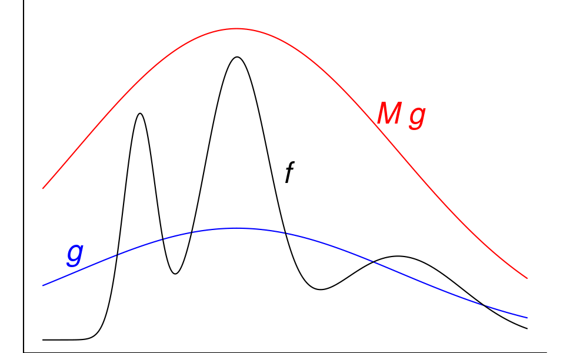
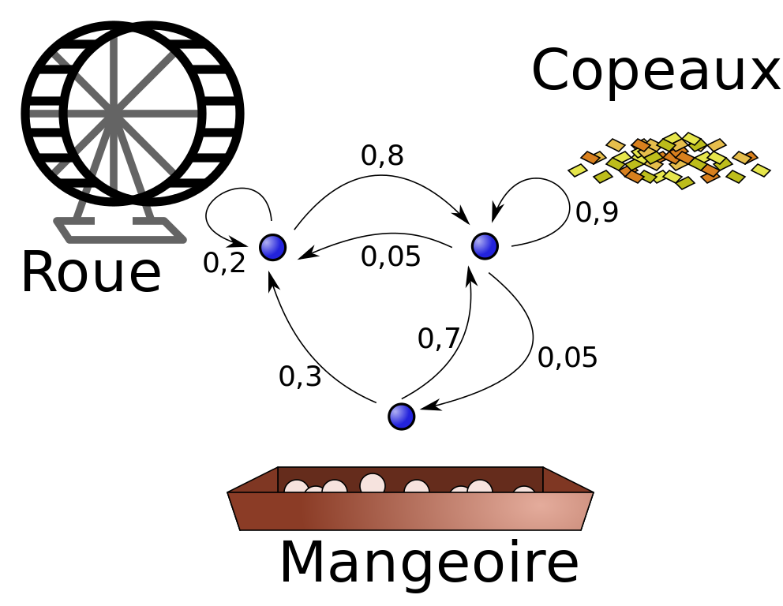
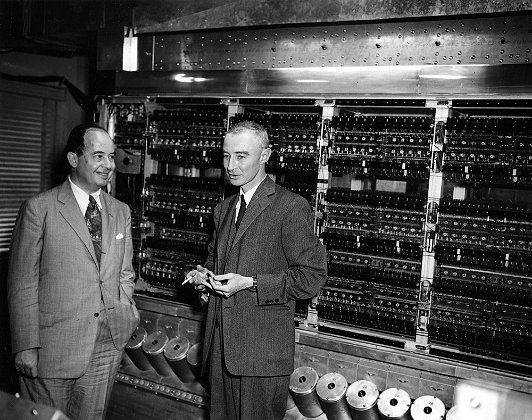

```{r setup, include=FALSE}
knitr::opts_chunk$set(message = FALSE, cache=FALSE)
```

## Some things that we learnt the last time

- You can fit easily the linear model in JAGS/BUGS
- Similar results to frequentist statistics for large samples
- Yet very convenient representation of uncertainty
- JAGS uses the Gibbs sampler
- The Gibbs sampler is one instance of Markov Chain Monte Carlo (MCMC)

Today: What is Markov Chain Monte Carlo? Two aspects

- Markov Chain
- Monte Carlo 

```{r french-comment, include=FALSE}
## Une analogie automobile
## cours précédent = sortir la Ferrari sur le parking
## cours actuel = regarder le moteur de la 2 CV
## plus tard on utilisera la Ferrari à plus grande vitesse
```

## The Monte Carlo method

<center>
{width=30%}
</center>

<!-- regular html comment --> 
<!-- https://sebastiansauer.github.io/figure_sizing_knitr/ --> 

Using random numbers allows to

- compute complex integrals $\int_a^b h(x)dx$ where we know what $h(x)$ looks like mathematically but not its integral. <!---- we can do that numerically too but not when x is huge ---->

\pause $\mathbb{E}(f(X)) = \int f(x) p(x) dx$. \pause 

Law of large numbers: $\mathbb{E}(f(X)) \approx  \frac{1}{n} \sum_{i=1}^{n} f(x_i)$ for $n$ large. \pause

- sample from a complex probability density function $p(x)$ which we know up to a proportionality constant. 

## Why do we want this in a Bayesian stats context? 

- Let's say we want $\mathbb{P}(a<\theta<b|y)$ or the mean parameter value $\mathbb{E}(\theta) = \int_{\mathbb{R}} \theta p(\theta|y) d\theta$. We're fine with computing $\int_a^b p(\theta|y)d\theta$ or the expected mean for many posteriors $p(\theta|y)$ over a grid for a *single* parameter $\theta$ \onslide<2-> but not $\int \int \int ... \int_{[a_1,b_1] \times [a_2,b_2] \times ... \times [a_d,b_d]} p(\theta_1,\theta_2,...,\theta_d|y)d\theta_1 d\theta_2...d\theta_d$ 

(imagine the really horrible grid in $d$ dimensions). 

\onslide<3->
- Any *marginal posterior distribution* will likely be like this. $p(\theta_1|y) = \int \int ... \int_{\mathbb{R}^{d-1}} p(\theta_1,\theta_2,...,\theta_d|y) d\theta_2... d\theta_d$. For an ANOVA with 1 mean and 5 effects this is already a quadruple integral. Nasty. 

\onslide<4->
- In many cases we only know $p(\theta|y)$ up to a proportionality constant (even with a single parameter $\theta$). Remember the annoying $\mathbb{P}(\text{data}) = m(y) = \int l(y|\theta) \pi(\theta) d\theta$ that pollutes the equation
$p(\theta|y) = \frac{l(y|\theta) \pi(\theta)}{m(y)}$? 

## A very short history of Monte Carlo integration

Stanislas "Stan" Ulam and John "Johnny" von Neumann were working in Los Alamos. Stan Ulam, a Polish mathematician, came up with the idea of using random numbers to evaluate complex integrals involved in chain reactions. Nicholas Metropolis suggested the code name *Monte Carlo*, given the connection between probability theory and games of chance (and that according to Metropolis, Ulam had an uncle that went playing there). 

\onslide<2->{A bit more history: Ulam stays in the US with von Neumann in 1935 (at Princeton). He was 26. In 1939 he flees to the US. In 1943 he joins the Manhattan project. Gets involved in issues that requires "pure pragmatism and the necessity to get a heuristic survey of the problem by simple-minded brute force, rather than by massive numerical work".}

\onslide<3-> In 1945 moves to UCLA as prof. Back to Los Alamos in 1946 to work on nuclear fusion, after some time in the hospital. In [1946-47 develops with von Neumann a statistical approach to the problem of neutron diffusion in fissionable material (Eckard 1987)](http://www-star.st-and.ac.uk/~kw25/teaching/mcrt/MC_history_3.pdf). Monte Carlo integration concept published in 1949 with Metropolis.

## A simpler example: computing $\pi$

Here we use random points to sample an area. Same problem as computing an integral. 

](figs/964px-Montecarlo-valeur-pi.png){ width=60% } 


## Computing $\pi$: your turn

$A = \pi R^2$ for the area of the circle. 

We compute numerically $p$ the probability of landing a randomly thrown dart in the circle. 

$p$ is the ratio between the area of the circle to that of the square ($(2R)^2=4 R^2$). 

$p = \frac{\pi_{\text{est}}}{4}$. From this, find $\pi$

\pause

Hint: use function `sample_p(n,L,R)` that uses $n$ samples for a circle of radius $R$ in a square of width $2L$ to get the fraction of the points in the circle. (Here $R=L=1$).  

## Computing $\pi$: solution

\small

```{r pi-comput,echo=TRUE}
sample_p = function(n,R,L){
  x=runif(n,-L,L)
  y=runif(n,-L,L)
  d2 = x^2+y^2
  return(sum(d2<R^2)/n)
}
4*sample_p(100,1,1)
4*sample_p(100,1,1)
4*sample_p(1000,1,1)
4*sample_p(1000,1,1)
```

\normalsize

## How do we get (nonuniform) random numbers? 

Uniform random numbers given by God. 

\onslide<2-> 
- Joking - I just don't have the time to cover it. 
Very useful topic for anybody doing computational science with random numbers. Check out `` set.seed() `` for the random generators used in R. 

\onslide<3-> 
- An important technique when we know the cumulative density function $F(x) = \mathbb{P}(X<x)$ is **inverse transform sampling**

\onslide<4> 
- For all the rest, one ref

[Non-uniform random variate generation by Luc Devroye](http://luc.devroye.org/rnbookindex.html)

## Inverse transform sampling: theory

We have random variable $X$ with pdf $f(x)$ and cdf $\mathbb{P}(X<x)=F(x)$. Let's assume transform $T$ is such that $T(U)=X$ where $U$ has uniform distribution in $[0,1]$. 

\onslide<2->Then $F(x) = \mathbb{P}(T(U)<x) = \mathbb{P}(U<T^{-1}(x)) = T^{-1}(x)$. 

\onslide<3->The last bit *is* confusing, that's because the $\mathbb{P}(U<u) = u$ for a uniform.

\onslide<4->Thus $T=F^{-1}$ and $F^{-1}(U)$ has the distribution of $X$.   

\onslide<5->There are smart variants of this even when you don't know analytically the cumulative distribution functions. See e.g. the [Box-Muller algorithm for generating Gaussian random variables](https://en.wikipedia.org/wiki/Box%E2%80%93Muller_transform)

## Inverse transform sampling: exponential distribution

[Exponential distribution](https://en.wikipedia.org/wiki/Exponential_distribution) with parameter $\lambda$. 

- probability density function $f(x) = \lambda \exp(-\lambda x)$
- cumulative distribution function $F(x) = 1 - \exp(-\lambda x)$

$T=F^{-1}$? ... 

Then simulate it in R. 

## Inverse transform sampling: exponential (solution)

[Exponential distribution](https://en.wikipedia.org/wiki/Exponential_distribution) with parameter $\lambda$. 

- probability density function $f(x) = \lambda \exp(-\lambda x)$
- cumulative distribution function $F(x) = 1 - \exp(-\lambda x)$

$T=F^{-1}$? $T(u) = - \frac{1}{\lambda} \ln(1-u)$

## Simulating the exponential distribution

\small

```{r exponential simu,fig.width=7,fig.height=5,out.width="60%"}
u=runif(100,0,1)
lambda = 0.5
x = (-1/lambda)*log(1-u)
plot(density(x,from=0),xlim=c(0,8),ylim=c(0,1),xlab="X",ylab="pdf")
curve(dexp(x,rate=0.5),col="red",add=TRUE)
```

[Ideas to improve this](https://stats.stackexchange.com/questions/65866/good-methods-for-density-plots-of-non-negative-variables-in-r)
\normalsize

## Acceptance-rejection sampling: theory

Needs an upper bound

{ width=50% }

- Draw $X_i \sim g$ and $U_i \sim \mathcal{U}(0,1)$
- if $u_i<\frac{f(x_i)}{M g(x_i)}$ accept and set $y_i = x_i$, else reject and redraw

Eventually $(y_1,...y_n) \sim f$ iid. Kinda magic, huh?  

## Acceptance-rejection sampling: practice

Let's take some not so nice function and something on top
\small
```{r horrible-function,fig.width=6,fig.height=4,out.width="80%"}
k <- function(x, a=.4, b=.08){exp( a * (x - a)^2 - b * x^4)}
curve(k(x), from = -4.5, to = 4.5, lwd=2, col="black",ylim=c(0,5))
curve(50*dnorm(x,0,5),from=-4.5,to=4.5,col="red",add=TRUE)
```


## Acceptance-rejection sampling: R code

```{r areject-code}
counter = 0
n=1000
y = rep(0,n)
while (counter<n){
    x=rnorm(1,0,5)
    u=runif(1)
    if(u<(k(x)/(50*dnorm(x,0,5)))){
      y[counter] = x
      counter=counter+1
      }
}

```

## Acceptance-rejection sampling: results

```{r areject,out.width="80%"}

plot(density(y),lwd=2,col="orange")
curve(k(x)/10, lwd=2, col="black",add=TRUE)

```

## Now we know how to do Monte-Carlo

We want $\mathbb{E}(Y)$ where $Y$ follows density $k(y)$? Compute $\frac{1}{n} \sum_{i=1}^{n}{y_i}$.

```{r areject-average}
mean(y)
sd(y)
```

etc. 

Now to Markov Chain Monte Carlo. $\rightarrow$ Markov Chain?


## Markov chain

A little bit of formalism:

- A **Markov chain** is a special kind of *stochastic process*. 

\onslide<2-> 
- A *stochastic process* is a family of random variables $X_t$ where $t$ is an index that allows to model dependency between the variables (often the time)

\onslide<3-> 
- When time is discrete, we can say "chains"

\onslide<4-> 
- E.g. weather. $\mathbb{P}$(rain tomorrow) depends on whether it has rained today.

\onslide<5-> 
- Remember, a *random variable* is in fact a function $X:\Omega \rightarrow \mathbb{R}$, associating one or several events $\omega$ (e.g. $\omega$ = "it rains") to numbers (e.g., $x=1$). 

\onslide<6-> 
- Thus a stochastic process $X_t(\omega)$ or $X(t,\omega)$ returns numbers as a function of two things: an event and an index (of time or position). 

## A very simple Markov chain -- weather prediction

Every day, either it rains or the sun shines. This is the true state $\{1,2\}$ I'm interested in. We assume that weather obeys the **Markov property** so that $\mathbb{P}(S_t|S_{t-1},S_{t-2},S_{t-3},...) = \mathbb{P}(S_t|S_{t-1})$. 

\onslide<2-> 
Of course, IRL it doesn't. But let's assume there are four possible transitions for tomorrow's weather 1 $\rightarrow$ 1, 1 $\rightarrow$ 2, 2 $\rightarrow$ 1, 2 $\rightarrow$ 2 and these only depend on the weather of the day. 

\onslide<3-> 
Markov himself used his eponymous chains to model transitions between letters in Pushkin's "Eugene Onegin". 


## What are the model parameters?

These are 

$\mathbb{P}(\text{rain at }t |\text{sun at }t-1) = 1 - \mathbb{P}(\text{sun at }t|\text{sun at }t-1)$ which is formally $\mathbb{P}(S_t = 1 | S_{t-1} = 2)$ // rain = 1, sun = 2. 

\onslide<2-> We also consider

$\mathbb{P}(\text{sun at } t |\text{rain at } t-1) = 1- \mathbb{P}(\text{rain at }t |\text{rain at }t-1)$ which is formally $\mathbb{P}(S_t = 2 | S_{t-1} = 1)$. 

\onslide<3-> We assume these do not change over time, so truly there are two transition probabilities: 

$\mathbb{P}$(rain $\rightarrow$ sun) and $\mathbb{P}$(sun $\rightarrow$ rain). 

This makes a *transition matrix*

\[ \Gamma =
\begin{pmatrix}
0.8 & 0.2\\
0.3 & 0.7
\end{pmatrix} \]


## A little bit of general theory

We stack all this in a matrix of **transition probabilities** $\Gamma = (\gamma_{ij})$ with $\gamma_{ij}=\mathbb{P}(S_t = j |S_{t-1} = i)$^[Many people use $P$ but we stick with $\Gamma$ to match @mcclintock2020uncovering] so that the rows sum to 1. 

\onslide<2->
In general, let's say I want to compute the probability of the states at time $t$ from those at times $t-1$. We use the [Law of Total Probability](https://en.wikipedia.org/wiki/Law_of_total_probability) to obtain

\onslide<3->
$p_{t}[j] = \mathbb{P}(S_t = j) = \sum_i \mathbb{P}(S_t = j |S_{t-1} = i) \mathbb{P}(S_{t-1} = i)$. Thus, switching to matrix notation, $p_t =  p_{t-1} \Gamma$. 

## A little bit of theory -- cont'd

So we have the update equation $p_{t} = p_{t-1} \Gamma$. It's for an **homogeneous** Markov chain as $\Gamma$ does not depend of time (the laws of weather do not change over time -- well, except for seasonality, climate change,...). 

\onslide<2->
Stationary distribution: $\pi = \pi \Gamma$ so that $\pi(I-\Gamma) = 0$. The left eigenvectors of $\Gamma$ with an eigenvalue of 1 are the stationary probabilities. 

\onslide<3->
True only when a *single stationary distribution exists*, but [for discrete-time Markov chains we know the conditions for such existence](https://en.wikipedia.org/wiki/Discrete-time_Markov_chain). The chain must be:

- irreducible (all states reachable from anywhere)
- aperiodic
- recurrent (all states are visited infinitely many times) 

\onslide<4->
All true for many reasonable examples. 

## Let's do another example: Doudou the hamster

{ width=50% }

Three states = Sleep, Eat, Work out. From [French Wikipedia](https://fr.wikipedia.org/wiki/Cha%C3%AEne_de_Markov). 

## Doudou the hamster

- Is the Markov chain irreducible ? recurrent ? aperiodic ?
...

- Suppose Doudou is now asleep. What about in 2 min ? in 10 min ?
...

- Suppose now that Doudou is working out. What about in 10 min ?
...

## Doudou the hamster - solutions

- Is the Markov chain irreducible ? recurrent ? aperiodic ?

Yes.

- Suppose Doudou is now asleep. What about in 2 min ? in 10 min ?

\[ p_0 = \begin{pmatrix} 1\ 0\ 0 \end{pmatrix}, p_0 \Gamma^2 = \begin{pmatrix} 0.885\ 0.045\ 0.070 \end{pmatrix}, p_2 \Gamma^8 = \begin{pmatrix} 0.884\ 0.044\ 0.072 \end{pmatrix}\]

- Suppose now that Doudou is working out. What about in 10 min ?

\[ p_0 = \begin{pmatrix} 0\ 0\ 1 \end{pmatrix}. p_0 \Gamma^{10} = \begin{pmatrix} 0.884\ 0.044\ 0.072 \end{pmatrix}\]

There is convergence! 

## MCMC = Markov Chain + Monte Carlo

Requires two types of convergence to evaluate say, the mean of parameter $\theta_1$, that is, $\mathbb{E}(\theta_1) = \int \theta_1 p(\theta_1|y) d\theta_1$.

\onslide<2-> We need Monte Carlo convergence, $\frac{1}{n} \sum_{i=1}^{n} \theta_1^{(i)} \longrightarrow \mathbb{E}(\theta_1)$

\onslide<3-> We also need Markov chain convergence, so that $p(\theta_1|y)$ is the equilibrium distribution of $\theta_1^{(i)}$. 

\onslide<4-> The latter is typically trickier to evaluate. 

\onslide<5-> What about other parameters, you would say? I gloss over those details. We'll see this later with the Gibbs sampler. 


## Back to Los Alamos

[Metropolis (et al.) algorithm from 1953. Equation of State Calculations by Fast Computing Machines](https://en.wikipedia.org/wiki/Equation_of_State_Calculations_by_Fast_Computing_Machines). 
Largely coded by Adrianna Rosenbluth and Augusta Teller, and conceptualized by Marshall Rosenbluth and Ed Teller. As the story goes, Metropolis mostly allowed to use the up-to-date computer MANIAC (Mathematical Analyzer, Numerical Integrator, and Computer). 

{ width=40% }

(incidentally, all of the authors were involved in making the H-bomb)

## The Metropolis algorithm
(formulation based on Gelman et al. Bayesian Data Analysis 2020)

1. Decide on $\theta^{(0)}$ the initial value, preferably random. 

2. For $k=0,1,2,...$
   a. Draw proposal parameter $\theta^*$ using proposal distribution $g(\theta^*|\theta^{(k)})$. In the Metropolis case (not Metropolis-Hastings), we require symmetry in g so that $g(\theta_a|\theta_b) = g(\theta_b|\theta_a)$. 
   b. Calculate the ratio $r=\frac{p(\theta^*|y)}{p(\theta^{(k)}|y)}$
   c. Set $\theta^{(k+1)} = \theta^*$ with probability $\text{min}(1,r)$, with $\theta^{(k+1)} = \theta^{(k)}$ if the draw fails.  Bernoulli sampling with param $\text{min}(1,r)$. 

Provided that you know $p(\theta|y)$ up to a proportionality constant you can always compute $r$. 

## Metropolis on a real example

Binomial model with Beta prior (remember lecture 1, $\mathbb{P}$(white falcon)). 
Now an example from my colleague Olivier Gimenez, binomial model for deer survival.

\small

```{r defining-functions}
survived = 19
released = 47

# log-likelihood function
loglikelihood <- function(x, p){
  dbinom(x = x, size = released, prob = p, log = TRUE)
}
# prior density
logprior <- function(p){
  dunif(x = p, min = 0, max = 1, log = TRUE)
}
# posterior density function (log scale)
logposterior <- function(x, p){
  loglikelihood(x, p) + logprior(p) # - log(Pr(data))
}

```

\normalsize

## Metropolis on a real example II 

For Metropolis  

 - we assume that the proposal step for $\theta^*$ is done by any symmetric distribution
 - we code the model using a function that returns a proposal given the previous value

[I'm copying Olivier's example here since it is a nice way to to implement such algorithms with modular functions.]

Now, your turn! 

## Metropolis on a real example III

\small 

```{r metropolis-proposal}

# propose candidate value
move <- function(x, away = .2){ 
  logitx <- log(x / (1 - x))
  logit_candidate <- logitx + rnorm(1, 0, away)
  candidate <- plogis(logit_candidate) # or exp(y)/(1+exp(y))
  return(candidate)
}
# but wait is this a symmetric proposal kernel? not sure. 

# propose candidate value
move <- function(x, epsilon = .05){ 
  v <- rnorm(1,0,epsilon)
  candidate <- x + v
  return(candidate)
}
# can go over the edges but is clearly symmetric

```

## Metropolis on a real example IV

\small 

```{r metropolis-loop}

metropolis <- function(steps = 100, theta0 = 0.5){
  
  theta <- rep(NA, steps) # pre-alloc memory
  theta[1] <- theta0   # start
  
  for (k in 2:steps){
    # propose candidate value for prob of success
    theta_star <- move(theta[k-1])
    # calculate ratio R
    pstar <- logposterior(survived, p = theta_star)  
    pprev <- logposterior(survived, p = theta[k-1])
    logR <- pstar - pprev
    R <- exp(logR)
    # decide to accept candidate value or to keep current value
    accept <- rbinom(1, 1, prob = min(R, 1))
    theta[k] <- ifelse(accept == 1, theta_star, theta[k-1])
  }
  theta
}

```


## Metropolis on a real example V

\small 

```{r using-metropolis}
steps <- 1000
chain1 <- metropolis(steps = steps, theta0 = 0.2)
chain2 <- metropolis(steps = steps, theta0 = 0.5)
chain3 <- metropolis(steps = steps, theta0 = 0.7)
mean(c(chain1,chain2,chain3))
``` 

```{r plotting-metropolis,fig.width=7,fig.height=3,echo=FALSE}
plot(chain1,col="blue",ylab="theta",xlab="Iterations")
lines(chain2,col="orange")
lines(chain3,col="brown")
```

\normalsize 

## One further exercise

Compare the theoretical $\text{Beta}(\alpha+y,\beta+n-y)$ posterior with the Metropolis estimates of the posterior distribution. 

[some ggplot & co. magic to make it appear even better](https://gist.github.com/oliviergimenez/5ee33af9c8d947b72a39ed1764040bf3)

## Further developments

[Metropolis-Hasting (1970)](https://en.wikipedia.org/wiki/Metropolis%E2%80%93Hastings_algorithm). Acceptance-rejection algorithm with proposal transition probabilities not necessarily symmetric. 

[Gibbs sampler, Geman brothers 1984](https://en.wikipedia.org/wiki/Gibbs_sampling). Popularized by Gelfand and Smith (1990). See Gelman's book for more historical details. Useful for high-dimensional $\theta$.  

\onslide<2-> JAGS/BUGS is based on the Gibbs sampler, which is [a particular multicomponent version of the Metropolis-Hastings algorithm](http://gregorygundersen.com/blog/2020/02/23/gibbs-sampling/), where *the proposal distributions are based on conditional distributions of the model* (as opposed to some random proposal). 

\onslide<3> A mathematical consequence of this is that the Metropolis ratio $r$ is 1, and one always accept each move. 

## Gibbs sampling algorithm

$$
\begin{aligned}
 \theta_1^{(k+1)} & \sim p(\theta_1^{(k)}|\theta_2^{(k)},\theta_3^{(k)},...,\theta_d^{(k)},y)\\
 \theta_2^{(k+1)} & \sim p(\theta_2^{(k)}|\theta_1^{(k+1)},\theta_3^{(k)},...,\theta_d^{(k)},y)\\
\theta_3^{(k+1)} & \sim p(\theta_3^{(k)}|\theta_1^{(k+1)},\theta_2^{(k+1)},\theta_4^{(k)}...,\theta_d^{(k)},y)\\
... \\
\theta_d^{(k+1)} & \sim p(\theta_d^{(k)}|\theta_1^{(k+1)},\theta_2^{(k+1)},...,\theta_{d-1}^{(k+1)},y) 
\end{aligned}
$$

Based on the sampling of the so-called *full conditionals* or *conditional posteriors*

- the proposal distribution $p(\theta_i|\theta_{-i},y)$ is **directly** taken from the model
- this works well when we have a way to specify analytically the posteriors up to a constant
- reduces a $d$-dimensional sampling problem to $d$ 1-dimensional problems 
- if each step cannot be sampled directly, we can use *Metropolis-within-Gibbs* or in the case of JAGS, the [slice sampler](http://www.mas.ncl.ac.uk/~ntwn/talks/slice.pdf). 


## Examples of MCMC sampling by the various algorithms

We will use [https://chi-feng.github.io/mcmc-demo/](https://chi-feng.github.io/mcmc-demo/)


## Alternatives to JAGS

- [Stan](https://mc-stan.org/), based on Hamiltonian Monte-Carlo and specifically NUTS. Large and dynamic community of developers. Language closer to C than R, although can be called easily from R. 
- [Nimble](https://r-nimble.org/), which implements a variety of samplers. Close to BUGS and JAGS. 
- [BayesianTools](https://cran.r-project.org/web/packages/BayesianTools/index.html), a R package calling various samplers
- [INLA](https://www.r-inla.org/) for Latent Gaussian Models
- [Greta](https://greta-stats.org/index.html), which uses Google TensorFlow and can be used on massive datasets. 

And these are just the ones I know about... 


## Why does the Metropolis algorithm work??

\small
Let's start from the end. Assume we have a Markov chain with stationary probability density $p(\theta)$ and transition densities $p(\theta_b|\theta_a)$. We have the detailed balance condition $p(\theta_b|\theta_a)p(\theta_a) = p(\theta_a|\theta_b)p(\theta_b)$. This means the chain is *reversible*; you get the same joint probability if time flows forward or backward. 

\onslide<2-> This can be rewritten
 $\frac{p(\theta_b|\theta_a)}{p(\theta_a|\theta_b)} = \frac{p(\theta_b)}{p(\theta_a)}$

\onslide<3-> 
Now we separate the transition in two steps, proposal and acceptance
\[ p(\theta_b|\theta_a)  = g(\theta_b|\theta_a) a(\theta_b,\theta_a)\]
and conversely we have 
\[ p(\theta_a|\theta_b)  = g(\theta_a|\theta_b) a(\theta_a,\theta_b)\]

\onslide<4->
Thus  $\frac{p(\theta_b|\theta_a)}{p(\theta_a|\theta_b)} = \frac{a(\theta_b,\theta_a)}{a(\theta_a,\theta_b)} = \frac{p(\theta_b)}{p(\theta_a)}$. We need to find an acceptance probability $a(.,.)$ that verifies this. $a(\theta_b,\theta_a) = \frac{p(\theta_b)}{p(\theta_a)}$ and 1 in the other direction. See [Gelman et al.'s book](http://www.stat.columbia.edu/~gelman/book/) for another take at this, p. 279 section 11.2 (free pdf). 

[For the more math-savvy: measure-theoretic derivation for the MH algo by Gundersen](http://gregorygundersen.com/blog/2019/11/02/metropolis-hastings/)
