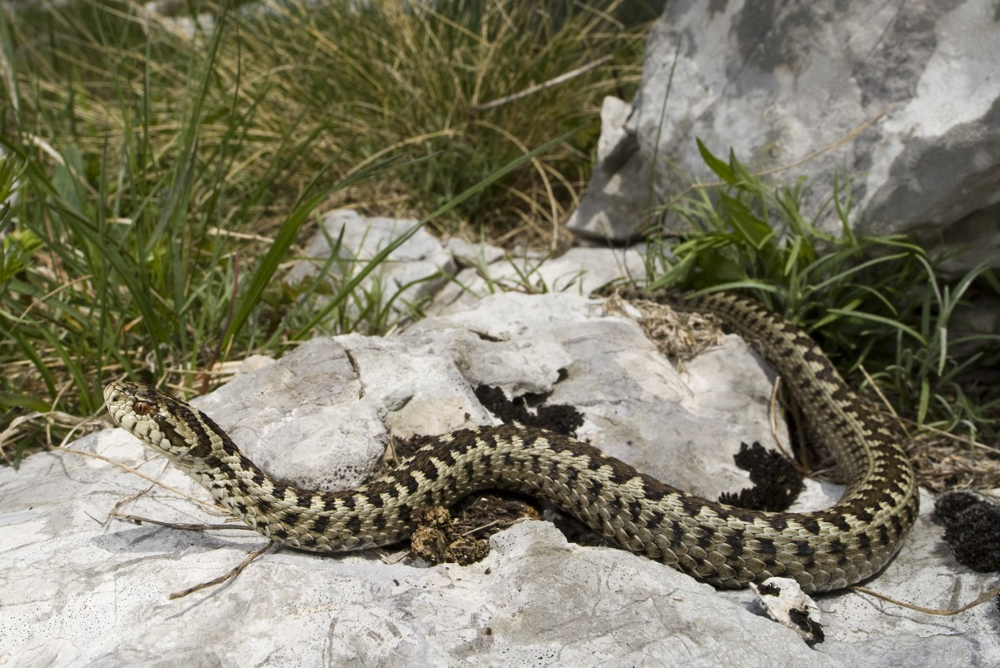

  
```{r setup, include=FALSE}
knitr::opts_chunk$set(message = FALSE, cache=FALSE)
```

## Some things that we learned the last time(s)

Session 3

- MCMC = Monte Carlo + Markov Chain
- Requires two types of convergence to compute an posterior means or posterior distribution
- JAGS uses the Gibbs sampler, a multicomponent variant of the Metropolis algorithm
- The Gibbs sampler allows to sample parameter-rich models

Session 2

- T-tests, ANOVA and the likes can be framed as the General Linear Model
- The Linear Model $Y=X\beta+E, \; E \sim \mathcal{N}(0,\Sigma)$ is easily fitted with JAGS
- Uncertainties in effects $\rightarrow$ posteriors

## Back to Snout-Vent Length (SVL) Snake data

\scriptsize

From Kéry (2010) \& TD 2
```{r data-generation}
### Data generation 
# same as TD2 but number of groups x 2
npop <- 10				# Number of populations: now choose 10 rather than 5
nsample <- 12				# Number of snakes in each
n <- npop * nsample			# Total number of data points

pop.grand.mean <- 50			# Grand mean SVL
pop.sd <- 5				# sd of population effects about mean
pop.means <- rnorm(n = npop, mean = pop.grand.mean, sd = pop.sd)
sigma <- 3				# Residual sd
eps <- rnorm(n, 0, sigma) 		# Draw residuals

x <- rep(1:npop, rep(nsample, npop))
X <- as.matrix(model.matrix(~ as.factor(x)-1))
y <- as.numeric(X %*% as.matrix(pop.means) + eps) # as.numeric is ESSENTIAL
```

## The data: Snout-vent length in snakes

\scriptsize

```{r plotting-data,fig.width=12,eval=TRUE,echo=TRUE}
boxplot(y ~ x, col = "grey", xlab = "Population", ylab = "SVL", main = "", las = 1) # Plot of generated data
abline(h = pop.grand.mean)
```

\normalsize

## Questions that we could ask

- Effect of being in population $i$
- Is there more variation between populations or more residual variation? 

## The one-way ANOVA: from code to maths

$J=10$ Groups. Notations

\[ Y_{ij} = \alpha_j + \epsilon_{ij}, \epsilon_{ij} \sim \mathcal{N}(0,\sigma^2)\]
Practical if $i=1,...,I$ is the same number of individuals per group. $n=I \times J$. 

\onslide<2->or again
\[ Y_{ij} \sim \mathcal{N}(\mu_{ij},\sigma^2), \mu_{ij} = \alpha_j \]
By that we mean that $\mathbb{E}(Y_{ij}) = \alpha_j$. 

\onslide<3-> Note: if you have an overall mean $\mu$ you need to remove a group

\onslide<4-> or again with $i=1,...,n$
\[ Y_{i} \sim \mathcal{N}(\mu_{i},\sigma^2), \mu_{i} = \alpha_{k[i]} \]
where $k[i]$ returns in which group is $i$. How we coded this JAGS.  

## Running again the ANOVA

\scriptsize

```{r anova-bayesian-data,echo=FALSE}
# Bundle and summarize the data set passed to JAGS
str(bdata <- list(y = y, x = x))
```

```{r anova-bayesian-model,echo=TRUE}
# Specify model in BUGS language
cat(file = "anova.txt", "
    model {
    
    # Priors
    for (i in 1:10){			# Implicitly define alpha as a vector
    alpha[i] ~ dnorm(0, 0.001) # Beware that a mean at 0 
    # only works because variance is huge.
    }
    sigma ~ dunif(0, 100)
    
    # Likelihood
    for (i in 1:120) {
    y[i] ~ dnorm(mean[i], tau) 
    mean[i] <- alpha[x[i]]
    }
    
    # Derived quantities
    tau <- 1 / ( sigma * sigma)
    }
    ")
```

```{r anova-bayesian-fit,echo=FALSE}
library(R2jags)
# Inits function
inits <- function(){ list(alpha = rnorm(10, mean = mean(y)), sigma = rlnorm(1) )}

# Parameters to estimate
params <- c("alpha", "sigma")

# MCMC settings
 nc <- 3  ;  ni <- 1200  ;  nb <- 200  ;  nt <- 2

# Call JAGS, check convergence and summarize posteriors
out <- jags(bdata, inits, params, "anova.txt", n.thin = nt, n.chains = nc, 
n.burnin = nb, n.iter = ni)
print(out, dig = 3)
```

## Estimated effects vs theoretical effects

\scriptsize

```{r anova-bayesian-effects,echo=FALSE,fig.width = 12,fig.height=7}
alpha_mean = out$BUGSoutput$mean$alpha
par(cex=2,mar = c(4,4,0,2)) #c(bottom, left, top, right))
plot(pop.means,alpha_mean,xlab="True alpha",ylab="Estimated alpha",pch=19)
abline(a=0,b=1)
# we find roughly the right estimates 
# (there's always variation on finite samples)
```

## Classical random effect modelling {.allowframebreaks} 

\scriptsize

```{r random-effect-frequentist}
### Restricted maximum likelihood (REML) analysis using R
library('lme4')				# Load lme4

pop <- as.factor(x)			# Define x as a factor and call it pop

lme.fit <- lmer(y ~ 1 + 1 | pop, REML = TRUE)
lme.fit					# Inspect results
ranef(lme.fit)				# Print random effects
```

## Classical random effect model - maths

\[ Y_{i} \sim \mathcal{N}(\mu_{i},\sigma^2), \mu_{i} = \alpha_{k[i]} \]
where $k[i]$ returns in which group is $i$. What's missing? 

\onslide<2-> 
i.i.d. observations. And then? 

\onslide<3-> We estimate the variance of the random effects
\[ \alpha_{j} \sim \mathcal{N}(\mu_{\alpha},\sigma_{\alpha}^2) \]
for $j=1,...,J$ (we have to specify a mean $\mu_{\alpha}$ too, we can set it to zero if there is an overall mean $\mu$ though)

## Random effect model in a Bayesian framework {.allowframebreaks} 

\scriptsize

```{r random-effect-bayesian,out.width=10}
# Bundle and summarize the data set passed to JAGS
str(bdata <- list(y = y, x = x, npop = npop, n = n))

# Specify model in BUGS language
cat(file = "re.anova.txt", "
model {

# Priors and some derived things
for (i in 1:npop){
    alpha[i] ~ dnorm(mu, tau.alpha) 	# Prior for population means
    effect[i] <- alpha[i] - mu 	# Population effects as derived quant’s
 }
 mu ~ dnorm(0,0.001)			# Hyperprior for grand mean svl
 sigma.alpha ~ dunif(0, 10)		# Hyperprior for sd of population effects
 sigma.res ~ dunif(0, 10)		# Prior for residual sd

# Likelihood
 for (i in 1:n) {
    y[i] ~ dnorm(mean[i], tau.res)
    mean[i] <- alpha[x[i]]
 }

# Derived quantities
 tau.alpha <- 1 / (sigma.alpha * sigma.alpha)
 tau.res <- 1 / (sigma.res * sigma.res)
}
")

```

## Fitting the model {.allowframebreaks} 

\scriptsize

```{r random-effects-technical-stuff}
 
# Inits function
inits <- function(){ list(mu = runif(1, 0, 100), sigma.alpha = rlnorm(1), sigma.res = rlnorm(1) )}

# Params to estimate
params <- c("mu", "alpha", "effect", "sigma.alpha", "sigma.res")

# MCMC settings
nb <- 1000  ;  nc <- 3  ;  ni <- 2000  ;  nt <- 2

# Call JAGS, check convergence and summarize posteriors
out2 <- jags(bdata, inits, params, "re.anova.txt", n.thin = nt, n.chains = nc, 
            n.burnin = nb, n.iter = ni)
```

## Model diagnostics {.allowframebreaks} 

```{r random-effect-model-diag,fig.width=10}
traceplot(out2,mfrow=c(4,4))
``` 

## Model results {.allowframebreaks} 

\scriptsize

```{r random-effect-model-results,out.width=12}
print(out2,dig=3)
``` 

## Comparison of variance estimates

\scriptsize

```{r compar-variance estimates}
### Well, comparison of sigma's... 
VarCorr(lme.fit)
out2$BUGSoutput$mean$sigma.res #true value is 3
out2$BUGSoutput$mean$sigma.alpha #true value is 5
```


## Comparison of fixed and random effects

\scriptsize

```{r comparison-fixed-random,fig.width=14,height=7}
## Plotting shrinkage
alpha_mean2 = out2$BUGSoutput$mean$alpha
barplot(t(matrix(c(alpha_mean,alpha_mean2),ncol=2,nrow=10)),beside=TRUE,col=c("black","blue"),ylim=c(30,60))
```

## Re-running the analysis with more shrinkage {.allowframebreaks}

Now we assume a prior $\sigma_{\alpha} \sim \text{Gamma}(100,50)$. 

More details on the [Gamma distribution](https://en.wikipedia.org/wiki/Gamma_distribution)

- $X \sim \text{Gamma}(a,b)$ with $a$ = shape, $b$ = rate = $\frac{1}{\theta}$ where $\theta$ is scale. 
- Properties: $\mathbb{E}(X) = a \theta = 100/50 = 2$ and $\mathbb{V}(X) = a \theta^2 = \frac{100}{2500} = 0.04$ so that $\text{SD}(X) = 0.2$. 

\scriptsize

```{r random-effect-shrink,echo=FALSE,results=FALSE}

# Specify model in BUGS language
cat(file = "re.anova.shrink.txt", "
model {

# Priors and some derived things
for (i in 1:npop){
    alpha[i] ~ dnorm(mu, tau.alpha) 	# Prior for population means
    effect[i] <- alpha[i] - mu 	# Population effects as derived quant’s
 }
 mu ~ dnorm(0,0.001)			# Hyperprior for grand mean svl
 
 # Gamma prior 
 m<-2 # we lower the variance
 sd<-0.2
 sh <- pow(m,2) / pow(sd,2)
 ra <-     m    / pow(sd,2)
 sigma.alpha ~  dgamma(sh,ra)	# Hyperprior for sd of population effects
 # narrow gamma prior (see later for explanation)
 # dexp(0.2) # more vague prior
 sigma.res ~ dunif(0, 10)		# Prior for residual sd

# Likelihood
 for (i in 1:n) {
    y[i] ~ dnorm(mean[i], tau.res)
    mean[i] <- alpha[x[i]]
 }

# Derived quantities
 tau.alpha <- 1 / (sigma.alpha * sigma.alpha)
 tau.res <- 1 / (sigma.res * sigma.res)
}
")

# Inits function
inits <- function(){ list(mu = runif(1, 0, 100), sigma.alpha = rexp(1,0.2), sigma.res = rlnorm(1) )}

# Params to estimate
params <- c("mu", "alpha", "effect", "sigma.alpha", "sigma.res")

# MCMC settings
nb <- 1000  ;  nc <- 3  ;  ni <- 2000  ;  nt <- 2

# Call JAGS, check convergence and summarize posteriors
out3 <- jags(bdata, inits, params, "re.anova.shrink.txt", n.thin = nt, n.chains = nc, 
            n.burnin = nb, n.iter = ni)

```

```{r random-effect-shrink-result,echo=TRUE,fig.width=12}
alpha_mean3 = out3$BUGSoutput$mean$alpha
out3$BUGSoutput$mean$sigma.alpha
barplot(t(matrix(c(alpha_mean,alpha_mean2,alpha_mean3),ncol=3,nrow=10)),beside=TRUE,col=c("black","blue","red"),ylim=c(30,60))
```

## To wrap up -- ANOVA vs REs in a Bayesian setup

>- The difference between ANOVA and random effects models boils down to estimation of variance between group-level effects 
>- (usually confusing because ANOVA *does* some variance partitioning)
>- ANOVA e.g. $\alpha_j \sim \mathcal{N}(50,100)$ 
>- RE model $\alpha_j \sim \mathcal{N}(\mu_{\alpha},\sigma_{\alpha}^2)$ and 
$\sigma_{\alpha} \sim \mathcal{U}(0,10)$ or $\sigma_{\alpha} \sim \text{Exp}(0,1/5)$
>- RE model with more shrinkage $\sigma_{\alpha} \sim \text{Gamma}(100,50)$.  

\onslide<5-> More material

- [Shrinkage aka partial pooling is a property of mixed models, not Bayesian estimation (though you can top it up using informative priors) ](https://m-clark.github.io/posts/2019-05-14-shrinkage-in-mixed-models/)
- [Kruschke's post on parameterizing the Gamma distribution](http://doingbayesiandataanalysis.blogspot.com/2012/08/gamma-likelihood-parameterized-by-mode.html)

## Bonus: fun and pretty snakes 

{ width=60% }

[Super épisode de La méthode scientifique sur France Culture,  08/11/2021](https://www.franceculture.fr/emissions/la-methode-scientifique/serpents-gardez-votre-sang-froid)
