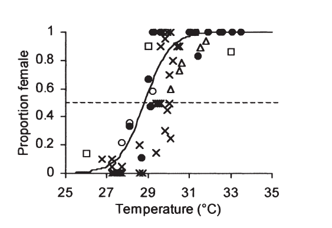

  
```{r setup, include=FALSE}
knitr::opts_chunk$set(message = FALSE, cache=FALSE)
library(R2jags)
```

## Some things that we learned the last time

- Poisson models good for rare events generating small counts
- Classical *link function* is the log-link so that $Y_i|\epsilon_i \sim \mathcal{P} (\exp(a + b x_i + \text{[stuff]} + \epsilon_i))$ (with extra dispersion)
- Posterior predictive checks

## The Binomial distribution: reminders and GLM

Let $U_i \sim \text{Bernoulli}(p)$ a coin toss with probability $p$. 

- Then $Y = \sum_{i=1}^n U_i \sim \mathcal{B}(n,p)$
- Converges to normal distribution for large $np$ ($\geq 10$) as $n$ grows
- $\mathbb{E}(Y) = np$ and $\mathbb{V}(Y) = np(1-p)$
- Conjugate prior for $p$ = Beta distribution. 

Two ways to specify a GLM: 

- $Y_i \sim \mathcal{B}(n,p)$ with $\text{logit}(p) = a + b x_i + \text{[stuff]}$ in which case the data resembles ``c(31,14,5,0,19)`` 
- $U_i \sim \mathcal{B}(p)$ with $\text{logit}(p) = a + b x_i + \text{[stuff]}$ in which case the data resembles ``c(0,0,1,0,1,1,0)`` 

## Environnementally-driven turtle sex determination

 ](fig/Green_Turtle_(Chelonia_mydas).jpg){ width=80% }

First described in 1966 by [Madeleine Charnier](https://en.wikipedia.org/wiki/Madeleine_Charnier) in a lizard, subsequent work on turtles (Chelonia) and Crocodylia, see [Janzen & Paukstis QRB 1991](http://aerg.canberra.edu.au/library/sex_reptile/1991_Janzen_Paukstis_tsd_reptiles_review.pdf). 

## $\mathbb{P}$(female hatchling) = f(temperature)

 ](fig/Chelonia_mydas_Green_Turtle_Hatchling.jpg){ width=80% }

## Empirical target

{ width=75% }

## Simulating data { .allowframebreaks }

We have got 25 groups $i$ of size 50 or less (i.e., how many baby turtles are hatched at one beach location $z_i$), with a different temperature in each group. 

```{r turtle-sim-data}
sample_size_per_group = round(30*runif(25))+20
n_groups = length(sample_size_per_group)
temperature = 25 + (1:n_groups)*8/25 + rnorm(n_groups,0,2)
par(cex=1.5,pch=19)
plot(1:n_groups,temperature,type="o",
     xlab="Group ID",ylab="Temperature")
```

## Binomial sampling { .allowframebreaks }

Females are born with probability $p_i$ in group $i$, which itself depends on temperature.

```{r turtle-sim-data-2}
Y = p = temperature
for (i in 1:n_groups){
  p[i] = 1/(1+exp(-3*(temperature[i]-mean(temperature)) ) )
  Y[i] = rbinom(1,sample_size_per_group[i],p[i])
}
par(cex=1.5,pch=19)
plot(temperature,p,type="p",
     xlab="Temperature",ylab="Pr(female)")
```

## The data  { .allowframebreaks}

```{r turtle-sim-data-3}
par(cex=1.5,pch=19)
plot(1:n_groups,Y,type="p",
     xlab="Number_group",ylab="N_females")
```

## Empirical proportion estimates  { .allowframebreaks }

```{r turtle-sim-data-4}
par(cex=1.5,pch=19)
plot(temperature,Y/sample_size_per_group,
     type="p",xlab="Number_group",
     ylab="Pr(female)")
```

## Prior predictive checks

We have seen posterior predictive distribution = the distribution of imaginary data under the fitted model (given a posterior distribution). 

Prior predictive distribution = the distribution of imaginary data under the priors. 

Let's say we have proportion $\theta \sim \text{Beta}(\alpha,\beta)$ which is the prior for a very simple $Y_i \sim \mathcal{B}(n,\theta)$ model where $n$ is known. Then simulating data under the prior predictive distribution can be done as

```{r,eval=FALSE,include=TRUE}
for (rep in 1:nrep){
  theta[rep] = rbeta(1,alpha,beta)
  Yrep[rep] = rbinom(1,size=n,prob=theta[rep]) 
}
```

(it's a [Beta-Binomial distribution](https://en.wikipedia.org/wiki/Beta-binomial_distribution))

## Prior predictive checks (practice) { .allowframebreaks }

\small 

```{r prpc-plot}
nrep = 100
n = 50
alpha=0.1
beta=0.1
Yrep = theta = rep(0,nrep)
for (rep in 1:nrep){
  theta[rep] = rbeta(1,alpha,beta)
  Yrep[rep] = rbinom(1,size=n,prob=theta[rep]) 
}
par(cex=1.5,pch=19)
hist(Yrep)
```

## Prior predictive checks -- better prior { .allowframebreaks }

\small 

```{r prpc-plot-better}
nrep = 100
n = 50
alpha=2
beta=2
Yrep = theta = rep(0,nrep)
for (rep in 1:nrep){
  theta[rep] = rbeta(1,alpha,beta)
  Yrep[rep] = rbinom(1,size=n,prob=theta[rep]) 
}
par(cex=1.5,pch=19)
hist(Yrep)
```


## Fitting the binomial model { .allowframebreaks }

Now we fit that model which writes mathematically like

$$ y_i \sim \mathcal{B}(z_i,p(\text{temp}_i)) $$
\small

```{r}
m11.data <- list(N = n_groups, y = Y, temp = temperature, 
                 z = sample_size_per_group)

cat(file="logistic.regression.txt","
model {
  mu_temp ~ dnorm(2, 0.1) ## prior of the mean temp
  gamma ~ dnorm(1, 0.1)  ## prior of the slope

  for (k in 1:N){
  y[k] ~ dbin(p[k],z[k])     ## likelihood
  logit(p[k])<-gamma*(temp[k]-mu_temp)
  }

}
")
```

## Running the model  { .allowframebreaks }

\scriptsize

```{r running logistic}

# Inits function
inits <- function(){list(gamma = rnorm(1, 0, 1),
                         mu_temp = rnorm(1,0,1))}

# Parameters to estimate
params <- c("gamma","mu_temp")

# MCMC settings
nc <- 3  ;  ni <- 2000  ;  nb <- 1000  ;  nt <- 2

# Call JAGS, check convergence and summarize posteriors
out <- jags(m11.data, inits, params, "logistic.regression.txt", n.thin = nt, 
            n.chains = nc, n.burnin = nb, n.iter = ni)
print(out, dig = 3)     # Bayesian analysis

```

## Priors on $\gamma$ and $\mu_{\text{temp}}$  { .allowframebreaks }

\small

```{r}
mu_temp = rnorm(100,2, 100) # prior of the mean temp
gamma = rnorm(100,1, 100)   # prior on the slope
x=seq(min(temperature),max(temperature),by=0.1)
par(mfrow=c(1,2))
plot(0, bty = 'n', pch = '', ylab = "Pr(female)", 
     xlab = "Temperature",ylim=c(0,1),
     xlim=c(min(temperature),max(temperature)))
for (kprior in 1:100) {
  prob = 1/(1+exp(-1*(x-mu_temp[kprior])) ) 
  lines(x,prob,type="l",col="blue")}
plot(0, bty = 'n', pch = '', ylab = "Pr(female)", 
     xlab = "Temperature",ylim=c(0,1),
     xlim=c(min(temperature),max(temperature)))
for (kprior in 1:100) {
  prob = 1/(1+exp(-gamma[kprior]*(x-mean(temperature))) ) 
  lines(x,prob,type="l",col="blue")}
```

## Better priors  { .allowframebreaks }

\small

```{r}
### Better priors
mu_temp = rnorm(100,25, 1) # prior of the mean temp
gamma = rnorm(100,1, 1)   # prior on the slope
par(mfrow=c(1,2))
plot(0, bty = 'n', pch = '', ylab = "Pr(female)", 
     xlab = "Temperature",ylim=c(0,1),
     xlim=c(min(temperature),max(temperature)))
for (kprior in 1:100) {
  prob = 1/(1+exp(-1*(x-mu_temp[kprior])) ) 
  lines(x,prob,type="l",col="blue")}
plot(0, bty = 'n', pch = '', ylab = "Pr(female)", 
     xlab = "Temperature",ylim=c(0,1),
     xlim=c(min(temperature),max(temperature)))
for (kprior in 1:100) {
  prob = 1/(1+exp(-abs(gamma[kprior])*(x-mean(temperature))) ) 
  lines(x,prob,type="l",col="blue")}

```


## Weakly informative priors  { .allowframebreaks }

What are they?

- Priors that provide *regularization* or *shrinkage*
- In practice, often $\mathcal{N}(0,\text{[small]})$ instead of $\mathcal{N}(0,\text{[huge]})$, e.g. ``dnorm(0,1)`` or ``dnorm(0,0.1)`` instead of ``dnorm(0,0.0001)`` in JAGS. 

[A more detailed explanation](https://onlinelibrary.wiley.com/doi/10.1111/oik.05985)

## A detour on identifiability, convergence, and priors

Borrowed from Mc Elreath's Statistical rethinking

We consider the (obviously wrong) model

\[ Y_i \sim \mathcal{N}(\mu,\sigma^2)\]

\[ \mu = \alpha_1 + \alpha_2\]

\[\alpha_j \sim \text{Unif(-10000,10000)} \text{ i.i.d}\]

\[ \sigma \sim \text{Exp}(1/10)\]

for 100 data points simulated as $\mathcal{N}(0,1)$. 

## Coding the stupid model 

\small

```{r stupid-model}

gaussian.data = list(y=rnorm(100,0,1),N=100)

cat(file="stupid.model.txt","
model {
    # Priors
    alpha[1] ~ dunif(-10000,10000) #dnorm(0,0.00001)
    alpha[2] ~ dunif(-10000,10000) #dnorm(0,0.00001)
    sigma ~ dunif(0,1000) #dexp(0.01) #dexp(1)
    tau<-pow(sigma,-2)
    
    # Likelihood
    mu<-alpha[1]+alpha[2]
    for (i in 1:N){
    y[i] ~ dnorm(mu,tau)
    }
   
}
")
```

## Fitting the stupid model { .allowframebreaks }

\scriptsize

```{r fitting-stupid}
# Initial values
inits <- function(){list(alpha=rnorm(2,0,1000))}
# Parameters to estimate
params <- c("alpha","sigma","mu")
# MCMC settings
nc <- 3  ;  ni <- 2000  ;  nb <- 1000  ;  nt <- 2
# Call JAGS, check convergence and summarize posteriors
out <- jags(gaussian.data, inits, params, "stupid.model.txt", n.thin = nt, 
            n.chains = nc, n.burnin = nb, n.iter = ni)
print(out, dig = 3)     # Bayesian analysis

```

## Traceplots

\small

```{r traceplots-stupid,out.width="80%"}
library(mcmcplots)
traplot(as.mcmc(out),parms=c("alpha","mu","sigma"))
```

## Less stupid model

\small

```{r less-stupid-model}
cat(file="less.stupid.model.txt","
model {
    # Priors
    alpha[1] ~ dnorm(0,0.1)
    alpha[2] ~ dnorm(0,0.1)
    sigma ~ dexp(1)
    tau<-pow(sigma,-2)
    
    # Likelihood
    mu<-alpha[1]+alpha[2]
    for (i in 1:N){
    y[i] ~ dnorm(mu,tau)
    }
   
}
")
```

Actually even a much smaller precision on $\alpha_j$'s prior would work

## Fitting the less stupid model { .allowframebreaks }

\scriptsize

```{r fitting-less-stupid}
# Initial values
inits <- function(){list(alpha=rnorm(2,0,1))}
# Parameters to estimate
params <- c("alpha","sigma","mu")
# MCMC settings
nc <- 3  ;  ni <- 2000  ;  nb <- 1000  ;  nt <- 2
# Call JAGS, check convergence and summarize posteriors
out <- jags(gaussian.data, inits, params, "less.stupid.model.txt", 
            n.thin = nt, n.chains = nc, n.burnin = nb, n.iter = ni)
print(out, dig = 3)     # Bayesian analysis

```

## Traceplots again

\small

```{r traceplots-less-stupid,out.width="80%"}
library(mcmcplots)
traplot(as.mcmc(out),parms=c("alpha","mu","sigma"))
```

## Now a real binary data example: bald eagles  { .allowframebreaks }

 ](fig/Bald_Eagle_with_Chum_Salmon_up_the_creek.jpg){ width=60% }

Records of (160!) salmon-pirating attempts by one Bald eagle on another Bald eagle (not always the same!). Also borrowed from McElreath's Statistical Rethinking p. 330. 

\small

```{r eagles-exploring data}
library(MASS)
data(eagles)
head(eagles)
#P // Size of pirating eagle (L = large, S = small).
#A // Age of pirating eagle (I = immature, A = adult).
#V // Size of victim eagle (L = large, S = small).
 
m2.data = list(N=nrow(eagles),y=eagles$y,z=eagles$n,
               P=as.numeric(eagles$P)-1,A=as.numeric(eagles$A)-1,
               V=as.numeric(eagles$V)-1)
# m2.data = list(N=nrow(eagles),y=eagles$y,z=eagles$n,P=eagles$P,A=eagles$A,V=eagles$V)

```


```{r include=FALSE,echo=FALSE}
eagles.glm <- glm(cbind(y, n - y) ~ P*A + V, data = eagles,
                  family = binomial) ##classic frequentist modelling
summary(eagles.glm)
# Small and immature birds capture less, small birds are more likely to have salmon stolen. So far so good.
```

