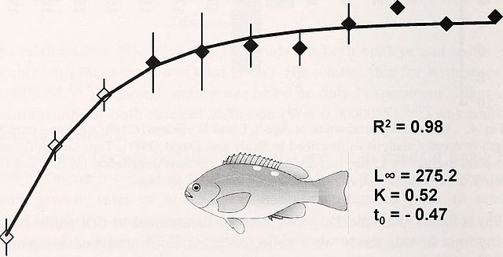
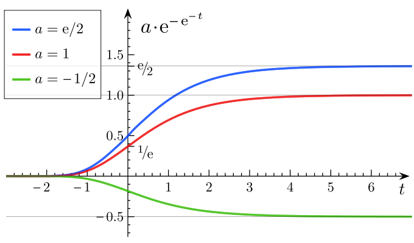
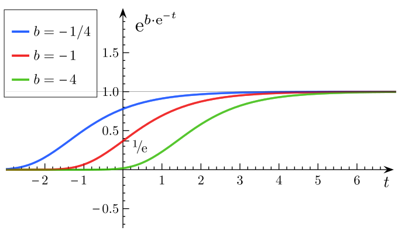
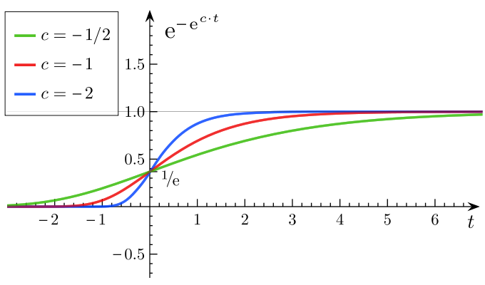

  
```{r setup, include=FALSE}
knitr::opts_chunk$set(message = FALSE, cache=FALSE)
library(R2jags)
library(ggmcmc)
```

## Things that we learned the last time

>- logistic regression with $y_i \sim \mathcal{B}(n,p_i)$ with
$\text{logit}(p_i) = \log(\frac{p_i}{1-p_i}) = a + b x_i$ or $\gamma(x_i-\mu_x)$
which is equivalent to 
$p_i = \text{logistic}(a + b x_i) = \frac{\exp(a + b x_i)}{1+\exp(a + b x_i)} = \frac{1}{1+\exp(-(a + b x_i))}$

>- "logistic ANOVA" 
$p_i = \text{logistic}(\alpha + \beta_1 x_{1i} + \beta_2 x_{2i} + \beta_3 x_{3i})$. Here
the logistic function maps $(-\infty,+\infty) \rightarrow [0,1]$. 

>- We can also want to use the logistic function to *model a known curve*, $y_i = f(x_i)+\epsilon_i$ or $y_i = f(t_i)+\epsilon_i$

## Organism growth basics: von Bertalanffy

{ width=70% }


\[L(t) = L_{\infty}(1-\exp(-k(t_i-t_0)))  + \epsilon_i\]

## Connection to dynamics 

\[  \frac{dL}{dt} = k (L_{\infty} - L)\]

\onslide<2->We'll do for practical another example of organismal growth, Gompertz growth (Winsor PNAS 1932). 

Dynamics

\[ \frac{d\ln(L)}{dt} = k(\ln(L_{\infty})-\ln(L))\]

Solution

\[ L(t) = a e^{-e^{b-ct}} \] where $a=L_{\infty} e^1$, $b = k t_0$ and $c=k$. 

Trick: note $l=\ln(L)$, solve von Bertalanffy for $l$, transform back. 

## The Gompertz growth curve is more logistic-like

{ width=45% }
{ width=45% }
{ width=45% }

## Mathematical cousins of von Bertalanffy: modelling *saturation*

Monod function (microbiology) aka Michalis-Menten (chemistry) aka Holling type II (ecology) aka ...

\[ f(x) = \frac{ax}{b+x}\]

## Another example of connection to dynamics: logistic population growth

$N$ = population size (microbes, humans, wild boars, plants,...)

\[\frac{dN}{dt} = rN \left(1-\frac{N}{K}\right)  \]

And the solution is...
\onslide<2->

\[ N(t) = \frac{N_0 e^{rt}}{1+N_0(e^{rt}-1)/K}\]

If we use $t=1,2,3,...$

\[ N_1 = \frac{N_0 e^{r}}{1+N_0(e^{r}-1)/K}, N_2 = \frac{N_1 e^{r}}{1+N_1(e^{r}-1)/K},...\]
aka Beverton-Holt model. 

## Two kinds of "noise" or stochasticity

Observational noise

\[ y_{t+1} = N_{t+1} + \epsilon_t, \; N_{t+1} = \frac{N_t e^{r}}{1+N_t(e^{r}-1)/K}, \; \epsilon_t \sim \mathcal{N}(0,\sigma^2) \text{ i.i.d}\]

>- The effect of $\epsilon_t$ does not accumulate. $\epsilon_1$ does not affect $N_8$. 

\onslide<2->
Process noise

\[ N_{t+1} = \frac{N_t e^{r+\epsilon_t}}{1+N_t(e^{r}-1)/K}, \; \epsilon_t \sim \mathcal{N}(0,\sigma^2) \text{ i.i.d}\]

>- The effect of $\epsilon_t$ does accumulate. $\epsilon_1$ *does* affect $N_8$. 
>- *autocorrelation* between $N_t$ values. This is a *time series* model
>- Of course in real life you can have both (and sometimes it is hard to distinguish between the two)

## Transforming this into a model we can fit 

We need to have $y_t \sim \mathcal{D}([\text{something}])$ to be able to fit a model in jags -- the data must be observed. 
\onslide<1->
Let's take $y_t = \ln(N_t)$. Then the previous model writes

\[ y_{t+1} = y_t + r + \epsilon_t - \ln(1+\alpha N_t), \; \epsilon_t \sim \mathcal{N}(0,\sigma^2) \text{ i.i.d}\]
with $\alpha = (e^{r}-1)/K$. 

\onslide<2-> Or again
\[ y_{t+1} = y_t + r + \epsilon_t - \ln(1+\alpha e^{y_t}), \; \epsilon_t \sim \mathcal{N}(0,\sigma^2) \text{ i.i.d}\]

\onslide<3-> This equivalent to 
\[ y_{t+1} = f(y_t) + \epsilon_t \; \epsilon_t \sim \mathcal{N}(0,\sigma^2) \text{ i.i.d}\]
or again $y_{t+1}|y_t \sim \mathcal{N}(f(y_t),\sigma^2)$. We have our distribution! 


## Fitting the logistic model in discrete-time with process noise { .allowframebreaks }

(you can fit the observational noise model with the solution $N(t)$ -- you can't fit the process noise model solution, you have to fit the *dynamics*)

\scriptsize

```{r simulating-data}
r=0.5
alpha=0.02
tmax=25
R=exp(r) 
K=(exp(r)-1)/alpha 
N_BH=N_BH1=rep(NA,tmax)
N_BH[1]=N_BH1[1]=1
for (t in 1:(tmax-1)){N_BH[t+1] = 
  (exp(r+rnorm(1,0,sqrt(0.05))))*N_BH[t]/(1+alpha*N_BH[t])}
for (t in 1:(tmax-1)){N_BH1[t+1] = 
  (exp(r+rnorm(1,0,sqrt(0.1))))*N_BH1[t]/(1+alpha*N_BH1[t])}
###
par(pch=20,cex=1.5)
plot(1:tmax,N_BH,type="o",ylim=range(c(N_BH,N_BH1)),xlab="Time",ylab="N")
lines(1:tmax,N_BH1,type="o",col="blue")
legend("topleft",c(expression(paste(sigma^"2","=0.05",sep="")),
                   expression(paste(sigma^"2","=0.1",sep=""))),
       col=c("black","blue"),lty=1,pch=16,bty="n")

```

## Let's fit the model

\scriptsize

```{r}
logistic.data <- list(logN = log(N_BH), tmax=tmax)

cat(file="logistic.growth.txt","
model {
  r ~ dnorm(2, 0.01) ## prior on r
  alpha ~ dlnorm(1, 0.01)  ## prior on alpha
  K <-(exp(r)-1)/alpha
  
  sigma ~ dunif(0.01,2)
  tau<-pow(sigma,-2)
  
  logN[1] ~ dnorm(0,1)
  N[1] <-exp(logN[1])

  #Likelihood
  for (t in 1:(tmax-1)){
  logNpred[t] <- logN[t]+ r - log(1 + alpha*N[t])
  logN[t+1] ~ dnorm(logNpred[t],tau)
  N[t+1] <- exp(logN[t+1])
  }

}
")
```


## Running the model  { .allowframebreaks }

\scriptsize

```{r running-logistic-growth}

# Inits function
inits <- function(){list(r = rnorm(1, 0, 1),
                         alpha = rlnorm(1,0,1))}

# Parameters to estimate
params <- c("r","alpha","K","sigma")

# MCMC settings
nc <- 3  ;  ni <- 2000  ;  nb <- 1000  ;  nt <- 2

# Call JAGS, check convergence and summarize posteriors
out <- jags(logistic.data, inits, params, "logistic.growth.txt", n.thin = nt, 
            n.chains = nc, n.burnin = nb, n.iter = ni)
print(out, dig = 3)     # Bayesian analysis

```

## Showing traceplots

\scriptsize

```{r traceplots, out.width="80%"}
S<-ggs(as.mcmc(out)) #R2jags
S<-filter(S,Parameter != "deviance")
ggs_traceplot(S)
```

## Showing correlations (r,K) and (r,$\alpha$)

\scriptsize

```{r pairs, out.width="80%"}
ggs_pairs(S)
```

## How to interpret correlations in the posteriors

>- Make some parameters difficult to interpret independently
>- Here $r$ is correlated to $\alpha$ but not really to $K$ despite the fact that the formula $K$ includes $r$ in our JAGS code
>- To maintain a nice curve that goes through the point cloud, $r$ must be correlated with $\alpha$. 
>- We'll see another example of this in the practical
