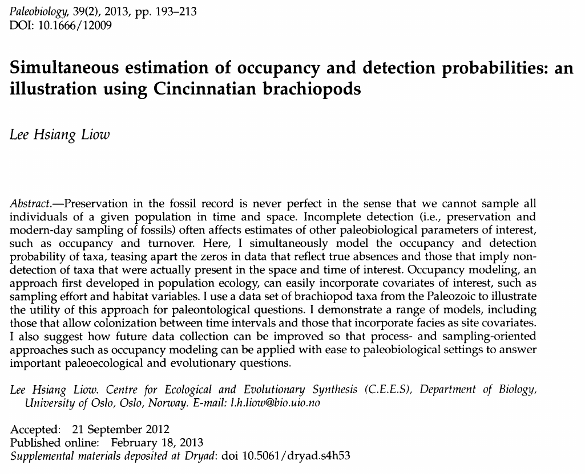
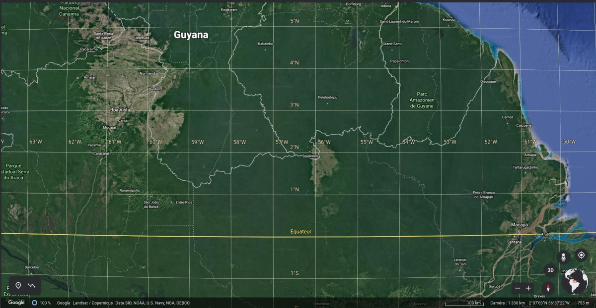
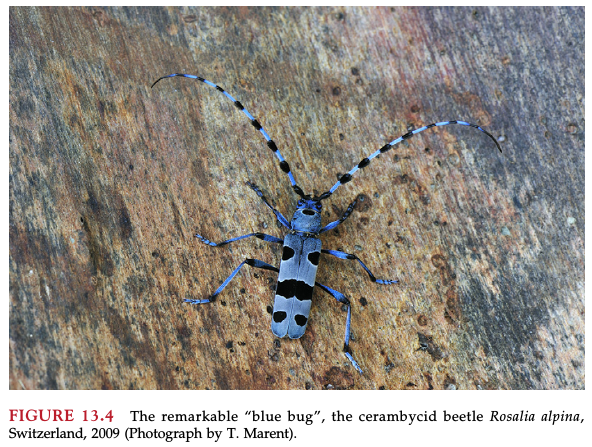

  
```{r setup, include=FALSE}
knitr::opts_chunk$set(message = FALSE, cache=FALSE)
library(R2jags)
library(ggmcmc)
```


## What is a latent variable? 

>- A variable that is *inferred* not *observed*
>- Random effects might fit that description
>- Can be discrete (1,2,...) or continuous
>- Here we will focus on discrete
>- Often arise in the context of modelling your observations with two submodels
>- Full model = Observation submodel + Process submodel (hidden)

## Used for ecology, evolution and much more

{ width=70% }

## A Hollywood archeology example

Indy & Lara criss-cross the Amazonian jungle in search of artefacts from hidden civilizations. They have a map with 100 x 100 km quadrats. In each quadrat, there could be cultural signs but these may not be visible. Thus we consider a probability of detection *p*. We want to know how rich the region is, i.e., what is the probability that a quadrat is truly occupied $\psi$. 

{ width=70% }

## Not such a silly example, actually

](fig/science_cover.jpg){ width=40% }
 

## Let's put this into equations

>- We number the site $i \in \{1,.., I\}$.  
>- Variable $X_{it}=1$ if there was an artefact observed at time $t$ in site $i$, 0 otherwise. They visit the sites at various times. 
>- Variable $Z_i$ is the latent state, i.e., has value 1 there truly an artefact within quadrat $i$. 

## What is the model? 

[Pen & paper moment]

\onslide<2-> Solution. For all $i$

$$
X_{it}|Z_i \sim \text{Bernoulli}(Z_i p)
$$

$$
Z_i \sim \text{Bernoulli}(\psi)
$$

## Is that OK? 

One can prove this is equivalent to

$$
X_{it} \sim \text{Bernoulli}(p \psi)
$$

(btw: true with binomial not just Bernoulli variables)

Problem: $p \psi$ is just one parameter. 

Proof: $\mathbb{P}(X_{it}=1) = \mathbb{P}(X_{it}=1|Z_i=1)\mathbb{P}(Z_{i}=1) +
 \mathbb{P}(X_{it}=1|Z_i=0)\mathbb{P}(Z_{i}=0) = p \times \psi + 0 \times (1-\psi)$

## Better occupancy model

$i$ site index in $\{1,...,I\}$

$t$ visit index in $\{1,...,T\}$

$$
X_{it}|Z_i \sim \text{Bernoulli}(Z_i p)
$$

$$
Z_i \sim \text{Bernoulli}(\psi)
$$

`Robust design': $T$ repeats within each site $i$. Parameters identifiable now. 

[(McKenzie et al. 2002)](https://esajournals.onlinelibrary.wiley.com/doi/10.1890/0012-9658%282002%29083%5B2248%3AESORWD%5D2.0.CO%3B2)

## Simulating the occupancy model

\scriptsize

```{r simulating-data}
#set.seed(42) 
I <- 250; 
T <- 10;
p <- 0.4;
psi <- 0.3;

z <- rbinom(I,1,psi); # latent occupancy state
y <- matrix(NA,I,T);  # observed state
for (i in 1:I){  y[i,] <- rbinom(T,1,z[i] * p);}
```

## JAGS/BUGS modelling 

\scriptsize

```{r bugs-model}
occupancy.data <- list(y=rowSums(y), T=T,nsite=I)

cat(file="occupancy.txt","
model {

  # Priors
    p~dunif(0,1)
    psi~dunif(0,1)
    
  # Likelihood
    for(i in 1:nsite){
      mu[i] <- p*z[i]
      z[i] ~ dbern(psi)
      y[i] ~ dbin(mu[i],T)
      }
    n<-sum(z[])
    }
")
```

## Running the model  { .allowframebreaks }

\scriptsize

```{r running-occupancy}

# Inits function
inits <- function(){list(p = runif(1, 0, 1),
                         psi = runif(1,0,1), z = rep(1, I))}
# we need to initialize z
# see https://bcss.org.my/tut/bayes-with-jags-a-tutorial-for-wildlife-researchers/occupancy-modelling/basic-occupancy-modelling/

# Parameters to estimate
params <- c("p","psi")

# MCMC settings
nc <- 3  ;  ni <- 2000  ;  nb <- 1000  ;  nt <- 2

# Call JAGS, check convergence and summarize posteriors
out <- jags(occupancy.data, inits, params, "occupancy.txt", n.thin = nt,
            n.chains = nc, n.burnin = nb, n.iter = ni)
print(out, dig = 3)     # Bayesian analysis

```

## Showing traceplots

\scriptsize

```{r traceplots, out.width="80%"}
S<-ggs(as.mcmc(out)) #R2jags
S<-filter(S,Parameter != "deviance")
ggs_traceplot(S)
```

## Showing correlations (p,$\psi$)

\scriptsize

```{r pairs, out.width="80%"}
ggs_pairs(S)
```

## Adding covariates

Possible to add covariates on detection probability

$p_{it} = \text{logistic}(\alpha_{k[i]} + \beta \times \text{survey duration}_{it})$

or 

$\text{logit}(p_{it}) = \ln(\frac{p_{it}}{1-p_{it}}) = \alpha_{k[i]} + \beta \times \text{survey duration}_{it}$


Covariates on occupancy probability, e.g. 

$\psi_{i} = \text{logistic}(\alpha_{\psi} + \beta_{\psi} \times \text{population density}_i)$

## Real-life example

{ width=50% }

## The dataset

* 27 sites (woodpiles), 6 replicated counts for each. 

* Covariates: `forest_edge` (edge or more interior), `date`, `hour` (date and hour of day, both of these are control variables)

* Detection at 10 of 27 woodpiles and from 1 to 5 times

* Questions:
    - Have some bluebugs been likely missed in some sites?
    - How many times should one visit a woodpile?
    - Effect of forest edge? (bluebugs are a typical forest species)
